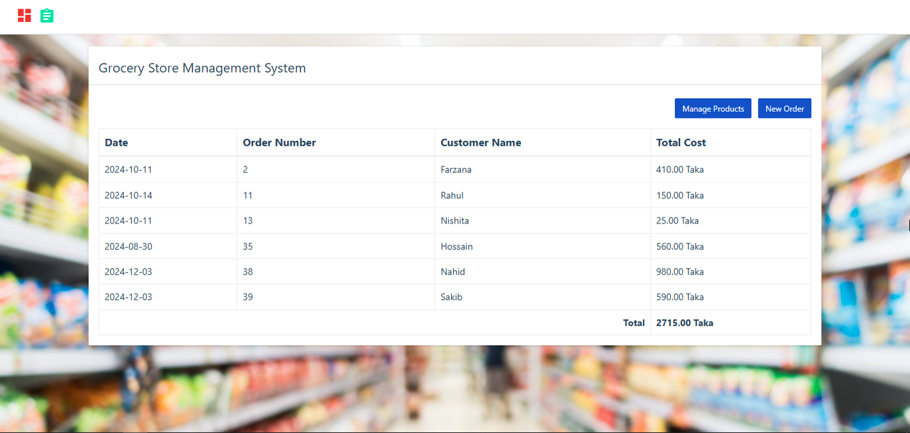

# 🛒 Grocery Store Web Application

This is a **3-tier web application** for managing a grocery store, built using **Python, Flask, MySQL**, and **HTML/CSS/JS/Bootstrap**.

---

## 🧱 Application Architecture

1. **Frontend**: HTML, CSS, JavaScript, Bootstrap  
2. **Backend**: Python, Flask  
3. **Database**: MySQL

---

## 📸 Screenshot



---

## 🚀 Features

- Add, update, and delete grocery items
- Inventory management with real-time database
- Responsive web interface
- Clean design using Bootstrap

---

## 🛠️ Installation Instructions

1. Install MySQL for Windows:  
   [Download MySQL](https://dev.mysql.com/downloads/installer/)

2. Install required Python package:

```bash
pip install mysql-connector-python
